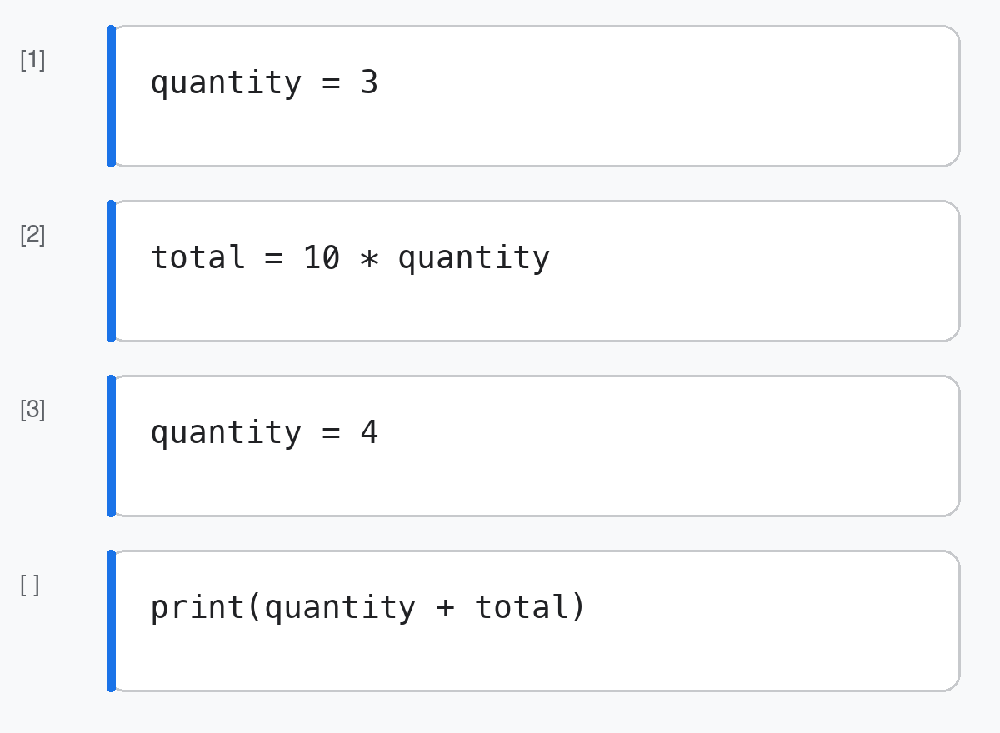
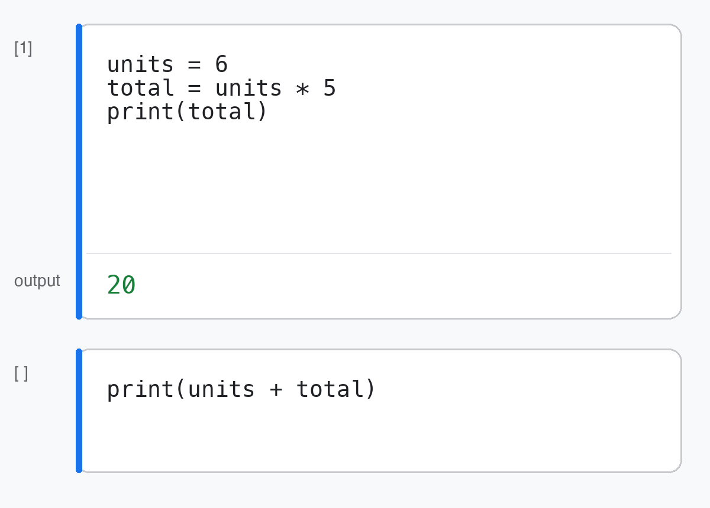

[← All quiz reviews](../README.md)

# Quiz review: Notebook 1

These questions revisit Jupyter notebooks, Colab, stored state, and testing with a changed input. Try each one before opening the answer.

## 1. Numbers and text

What does the final line display?

```python
number_value = 8
text_value = "8"
print(text_value + "2")
```

- `10`
- `82`
- An error message

<details>
<summary>Answer and explanation</summary>

**Answer:** `82`

`text_value` stores the string `"8"`. Adding two strings joins their text, so the final line produces `"82"`, which `print()` displays as 82. `number_value` is not used by the final line.

</details>

## 2. Stored state in page order

The first three cells were run in the order shown. What will the last cell display when you run it?



- `33`
- `34`
- `43`
- `44`
- An error

<details>
<summary>Answer and explanation</summary>

**Answer:** `34`

The multiplication cell ran while `quantity` was 3, so `total` stored 30. Changing `quantity` to 4 later does not recalculate `total`; the final cell displays `4 + 30`.

</details>

## 3. Stored state out of page order

The code is in the same page order as Question 2, but the execution counts are `[1]`, `[3]`, and `[2]`. What will the last cell display when you run it?


- `33`
- `34`
- `43`
- `44`
- An error

<details>
<summary>Answer and explanation</summary>

**Answer:** `44`

Execution counts show run order, not page position. Python ran `quantity = 3`, then `quantity = 4`, then `total = 10 * quantity`, so `total` stored 40. The final cell displays `4 + 40`.

</details>

## 4. Visible source, stored state, and a clean run

Cell A originally had `units = 4`. It was run and then edited to `units = 6` without being rerun. Cell B is the second cell in the image.



If you run Cell B now, what will it display? What will it display after **Restart session and run all**?

- `24`, then `36`
- `26`, then `36`
- `36`, then `36`
- `24`, then `30`

<details>
<summary>Answer and explanation</summary>

**Answer:** `24`, then `36`

Editing a cell does not run it. Before the restart, Python still remembers `units = 4` and `total = 20`, so Cell B displays 24. Restarting clears that state; running all executes the visible `units = 6`, stores `total = 30`, and displays 36.

</details>

## 5. Use a changed input to expose swapped rates

Both proposals print 100 with these starting values:

```python
regular = 4
rush = 4
regular_fee = 10
rush_fee = 15

proposal_a = regular * regular_fee + rush * rush_fee
proposal_b = regular * rush_fee + rush * regular_fee

print(proposal_a)
print(proposal_b)
```

Change only `rush` from 4 to 6 and rerun. What do `proposal_a` and `proposal_b` produce?

- `100` and `100`
- `120` and `130`
- `130` and `130`
- `130` and `120`

<details>
<summary>Answer and explanation</summary>

**Answer:** `130` and `120`

Equal starting quantities let both formulas produce 100, hiding the swap. With `rush = 6`, proposal A keeps each quantity with its matching fee (`4 * 10 + 6 * 15 = 130`). Proposal B swaps the fees (`4 * 15 + 6 * 10 = 120`).

</details>
